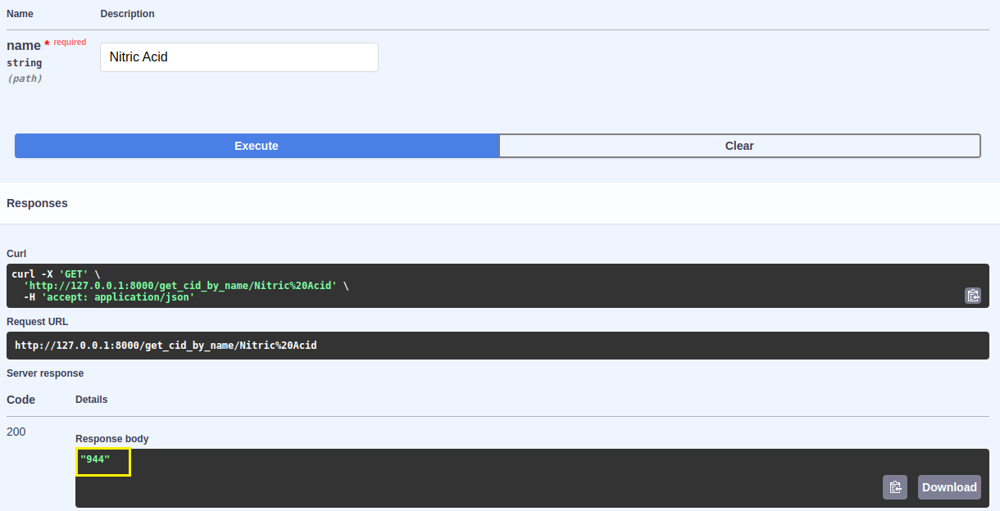
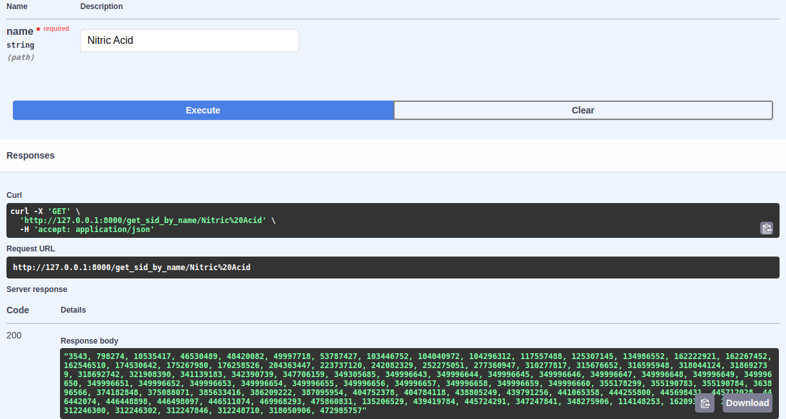

# PubChem CID and SID Checker

API for getting PubChem CID or SID by name.

### Installation

```
pip install -r requirements.txt
```

### Run FastAPI application under Uvicorn

```
uvicorn main:app --reload
```

### API Usage Examples:



